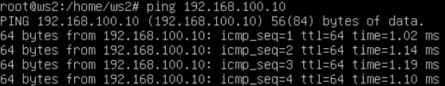
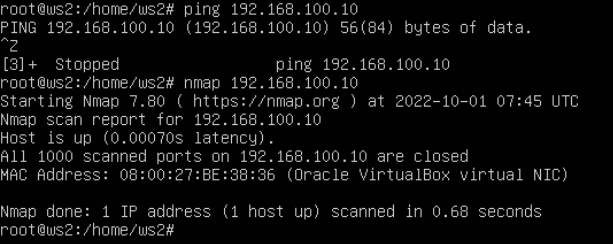
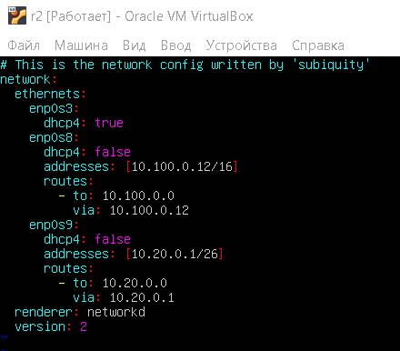
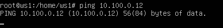
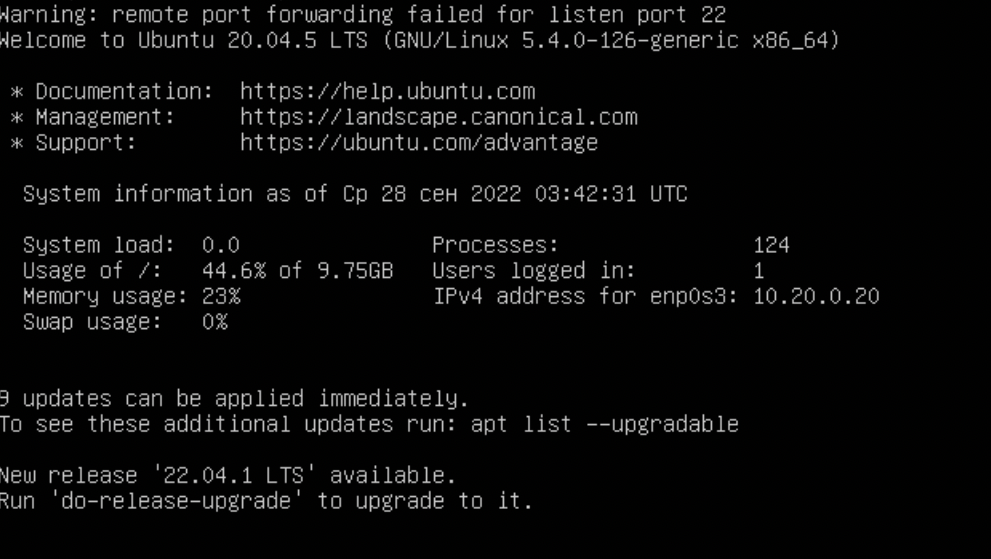

## Part 1. Инструмент ipcalc

### 1.1. Сети и маски
##### 1) Адрес сети *192.167.38.54/13*

##### 2.1) Перевод маски *255.255.255.0* в префиксную и двоичную запись

>Префикс /24
> 
##### 2.2) /15 в обычную и двоичную

##### 2.3) 11111111.11111111.11111111.11110000 в обычную и префиксную

* В обычную -  255.255.255.240
* В префиксную - /28

##### 3) Минимальный и максимальный хост в сети 12.167.38.4 при масках:

* 3.1) /8

* 3.2) 11111111.11111111.00000000.00000000

* 3.3) 255.255.254.0

* 3.4) /4

### 1.2. localhost

##### Определить и записать в отчёт, можно ли обратиться к приложению, работающему на localhost, со следующими IP: 194.34.23.100, 127.0.0.2, 127.1.0.1, 128.0.0.1

Поочередно пропингуем

* 194.34.23.100

>Пинг не проходит, обратиться нельзя

* 127.0.0.2

>Пинг проходит, обратиться можно

* 127.1.0.1

>Пинг проходит, обратиться можно

* 128.0.0.1

>Пинг не проходит, обратиться нельзя

### 1.3. Диапазоны и сегменты сетей

##### 1) какие из перечисленных IP можно использовать в качестве публичного, а какие только в качестве частных: *10.0.0.45*, *134.43.0.2*, *192.168.4.2*, *172.20.250.4*, *172.0.2.1*, *192.172.0.1*, *172.68.0.2*, *172.16.255.255*, *10.10.10.10*, *192.169.168.1*

#### Классификация IP

Существуют классификации IP-адресов как "частных" и "общедоступных". Следующие диапазоны адресов зарезервированы для частных сетей (также известных как LAN):
- *10.0.0.0* — *10.255.255.255* (*10.0.0.0/8*),
- *172.16.0.0* — *172.31.255.255* (*172.16.0.0/12*),
- *192.168.0.0* — *192.168.255.255* (*192.168.0.0/16*).
- *127.0.0.0* — *127.255.255.255* (Зарезервировано для интерфейсов обратной связи (не используется для связи между узлами сети), так называемый localhost)

Следовательно:

* 10.0.0.45 - частный
* 134.43.0.2 - публичный
* 192.168.4.2 - частный
* 172.20.250.4 - частный
* 172.0.2.1 - публичный
* 192.172.0.1 - публичный
* 172.68.0.2 - публичный
* 172.16.255.255 - частный

Так же приведу пару примеров с использованием ipcalc

* 10.10.10.10 - частный

* 192.169.168.1 - публичный

##### 2) какие из перечисленных IP адресов шлюза возможны у сети *10.10.0.0/18*: *10.0.0.1*, *10.10.0.2*, *10.10.10.10*, *10.10.100.1*, *10.10.1.255*

Диапазон 10.10.0.1 - 10.10.63.254. Сопоставляем:

* 10.0.0.1 - невозможен
* 10.10.0.2 - возможен
* 10.10.10.10 - возможен
* 10.10.100.1 - невозможен
* 10.10.1.255 - возможен

## Part 2. Статическая маршрутизация между двумя машинами

##### С помощью команды `ip a` посмотреть существующие сетевые интерфейсы

Для машины ws1:

Для машины ws2:

Опишем сетевой интерфейс для обеих машин

etc/netplan/00-installer-config.yaml файл для первой машины:

etc/netplan/00-installer-config.yaml файл для второй машины:

Здесь мы прописали соответствующие адреса

Для подтверждения изменений прописываем команду netplan apply. В случае успешного выполнения ничего не будет выведено

### 2.1. Добавление статического маршрута вручную

Построим статический маршрут от одной машины до другой при помощи команды ip r add

Дла второй аналогично, с имзенением адреса, указывая первую машину

Попробуем пропинговать

Пинг проходит от ws1 к ws2 и наоборот

### 2.2. Добавление статического маршрута с сохранением

После перезапуска машин маршруты, установленые вручную, сбросятся. Изменим yaml файлы для сохранения маршрутов

Для первой машины указываем путь до второй машины:

Аналогично в обратную сторону для второй машины:

Пропингуем для проверки

Статическая маршрутизация установлена

## Part 3. Утилита **iperf3**

### 3.1. Скорость соединения
##### Перевести и записать в отчёт: 8 Mbps в MB/s, 100 MB/s в Kbps, 1 Gbps в Mbps

* 8 Mbp/s = 1 MB/s
* 100 MB/s = 819200 Kbp/s
* 1 Gbp/s = 1024 Mbp/s

### 3.2. Утилита **iperf3**
##### Измерим скорость соединения между ws1 и ws2

Для этого введем в консоль машины-сервера (ws1) команду:

Далее с машины-клиента (ws2) запустим тест

Тем временем на сервер так же придет результат

## Part 4. Сетевой экран

### 4.1. Утилита **iptables**

Создадим файл /etc/firewall.sh, имитирующий фаерволл, на ws1 и ws2

Для ws1:

Для ws2:

Запустим оба файла

При успешном выполнении команды в консоль ничего не выведется

Разница в стратегиях заключается в том, что на первой машине у нас сначала идет правило, запрещающее пинг, и только после него - разрешающее, в то время как на второй машине ровно наоборот - сначала разрешение, потом запрет

Пропинговав 1ю машину, выясним, что она не пингуется, хотя хост поднят:

Пропингуем 2ю машину:

## Part 5. Статическая маршрутизация сети

Для создания сети, настроим машины в VirtualBox, а именно - откроем сетевые адаптеры. Для рабочих станций будет 2 адаптера (один для выхода в интернет, другой для внутренней сети), дла роутеров - 3 (согласно схеме, у каждого роутера 2 внутренние сети)

Для роутера будет открыт 3-й адаптер для внутренней сети

Далее прописываем etc/netplan/00-installer-config.yaml для каждой машины

Для ws11:

Для r1:

Для r2:

Для ws22:

Для ws21:

Пропингуем с ws11 r1:

С ws21 пропингуем ws22:

### 5.2. Включение переадресации IP-адресов.
Для включения переадресации IP, выполним команду на роутерах:
`sysctl -w net.ipv4.ip_forward=1`

При таком подходе переадресация не будет работать после перезагрузки системы

Откроем файл /etc/sysctl.conf и добавьте в него следующую строку:
`net.ipv4.ip_forward = 1`

При использовании этого подхода, IP-переадресация включена на постоянной основе.

### 5.3. Установка маршрута по-умолчанию

Настроить маршрут по-умолчанию (шлюз) для рабочих станций

Для ws11:

Для других двух машин аналогично указывается адрес роутера r2

Через `ip r` убедимся, что маршрут добавился в таблицу маршрутизации

Пропингуем с ws11 роутер r2:

Пинг не возвращается, однако, убедимся, что он доходит:

### 5.4. Добавление статических маршрутов

Добавим в роутеры r1 и r2 статические маршруты в файле конфигураций

Для r1:

Для r2:

Через `ip r` посмотрим таблицы маршрутизации на обоих роутерах

Для r1:

Для r2:

Запустим команды на ws11:
`ip r list 10.10.0.0/18` и `ip r list 0.0.0.0/0`:

В компьютерных сетях маршрут по умолчанию - это конфигурация интернет-протокола (IP), которая устанавливает правило пересылки для пакетов, когда конкретный адрес узла следующего перехода недоступен из таблицы маршрутизации или других механизмов маршрутизации.

Маршрут по умолчанию - это, как правило, адрес другого маршрутизатора, который обрабатывает пакет таким же образом: если маршрут совпадает, пакет пересылается соответствующим образом, в противном случае пакет пересылается на маршрут по умолчанию этого маршрутизатора. Процесс оценки маршрута в каждом маршрутизаторе использует метод сопоставления с самым длинным префиксом для получения наиболее конкретного маршрута. Сеть с самой длинной маской подсети или сетевым префиксом, который соответствует IP-адресу назначения, является сетевым шлюзом следующего перехода. Процесс повторяется до тех пор, пока пакет не будет доставлен на узел назначения, или ранее по маршруту, когда маршрутизатор не имеет доступного маршрута по умолчанию и не может направить пакет иным способом. В последнем случае пакет отбрасывается, и может быть возвращено сообщение о недоступности назначения ICMP.[1] Каждый обход маршрутизатора считается одним переходом при расчете расстояния для пути передачи.

Устройство, на которое указывает маршрут по умолчанию, часто называют шлюзом по умолчанию, и оно часто выполняет другие функции, такие как фильтрация пакетов, брандмауэр или операции прокси-сервера.

Маршрут по умолчанию в Internet Protocol версии 4 (IPv4) обозначается как нулевой адрес, 0.0.0.0/0 в нотации CIDR.[2] Аналогично, в IPv6 маршрут по умолчанию задается с помощью ::/0. Маска подсети задается как /0, что эффективно определяет все сети и является кратчайшим возможным совпадением. Поиск маршрута, который не соответствует ни одному другому правилу, возвращается к этому маршруту.

В сегменте сети самого высокого уровня администраторы обычно указывают маршрут по умолчанию для данного хоста к маршрутизатору, который подключен к поставщику сетевых услуг. Таким образом, пакеты с адресатами за пределами локальной сети организации, обычно адресатами в Интернете или глобальной сети, пересылаются на маршрутизатор с подключением к этому провайдеру.

### 5.5. Построение списка маршрутизаторов

Запустим на r1 команду дампа:
`tcpdump -tnv -i eth0`

После этого запустим команду `traceroute`:

В этот момент на r1:

`traceroute` передвигается по маршрутам по умолчанию, посылает по 3 пакета и засекает время

### 5.6. Использование протокола **ICMP** при маршрутизации
Запустим на r1 перехват сетевого трафика, проходящего через eth0 с помощью команды:
`tcpdump -n -i eth0 icmp`

Пропингуем с ws11 несуществующий IP (например, *10.30.0.111*) с помощью команды:
`ping -c 1 10.30.0.111`

Тем временем на r1:

## Part 6. Динамическая настройка IP с помощью **DHCP**

Для r2 настроим в файле */etc/dhcp/dhcpd.conf* конфигурацию службы **DHCP**:

### 1) указать адрес маршрутизатора по-умолчанию, DNS-сервер и адрес внутренней сети.

`apt install isc-dhcp-server`

### 2) в файле *resolv.conf* прописать `nameserver 8.8.8.8.`

Перезагрузим службу **DHCP** командой `systemctl restart isc-dhcp-server`

Перепишем yaml файл, чтобы получать IP по dhcp

Машину ws21 перезагрузим при помощи `reboot` и через `ip a` покажем, что она получила адрес:

Пропингуем ws22 с ws21:

Укажем MAC адрес у ws11, для этого в *etc/netplan/00-installer-config.yaml* надо добавить строки: `macaddress: 10:10:10:10:10:BA`, `dhcp4: true`

Так же укажем этот адрес в соответствующем адаптере виртуальной машины

Проделаем аналогично для r1 с привязкой по MAC-адресу

В файле *resolv.conf* пропишем `nameserver 8.8.8.8.`

Перезагрузим службу **DHCP** командой `systemctl restart isc-dhcp-server`

Запросим с ws21 новый ip:

Материалы к 6-й части:
* https://www.opennet.ru/base/net/dhcp_setup.txt.html
* https://www.youtube.com/watch?v=HDpCo7DvsgY

## Part 7. **NAT**

В файле */etc/apache2/ports.conf* на ws22 и r1 изменим строку `Listen 80` на `Listen 0.0.0.0:80`, то есть сделаем сервер Apache2 общедоступным

Запустим веб-сервер Apache командой `service apache2 start` на ws22 и r1

Добавим в фаервол, созданный по аналогии с фаерволом из Части 4, на r2 следующие правила:
1) Удаление правил в таблице filter - `iptables -F`
2) Удаление правил в таблице "NAT" - `iptables -F -t nat`
3) Отбрасывать все маршрутизируемые пакеты - `iptables --policy FORWARD DROP`

Запустим файл

Проверим соединение между ws22 и r1 командой `ping`

4) Разрешим маршрутизацию всех пакетов протокола **ICMP**

Проверим соединение между ws22 и r1 командой `ping`

Добавим в файл ещё два правила:
5) Включим **SNAT**, а именно маскирование всех локальных ip из локальной сети, находящейся за r2 (по обозначениям из Части 5 - сеть 10.20.0.0)

6) Включим **DNAT** на 8080 порт машины r2 и добавить к веб-серверу Apache, запущенному на ws22, доступ извне сети

Проверим соединение по TCP для **SNAT**, для этого с ws22 подключимся к серверу Apache на r1 командой:
`telnet [адрес] [порт]`

Проверим соединение по TCP для **DNAT**, для этого с r1 подключиться к серверу Apache на ws22 командой `telnet` 

## Part 8. Дополнительно. Знакомство с **SSH Tunnels**

Запустить на r2 фаервол с правилами из Части 7

Запустим веб-сервер **Apache** на ws22 только на localhost (то есть в файле */etc/apache2/ports.conf* изменим строку `Listen 80` на `Listen localhost:80`)

Воспользуемся *Local TCP forwarding* с ws21 до ws22, чтобы получить доступ к веб-серверу на ws22 с ws21

Запустим с ws21 `ssh -L local_port:remote_ip:remote_port user@hostname`

Воспользуемся *Remote TCP forwarding* c ws11 до ws22, чтобы получить доступ к веб-серверу на ws22 с ws11

Запустим с ws11 `ssh -R remote_port:local_ip:local_port user@hostname`

Проверим

